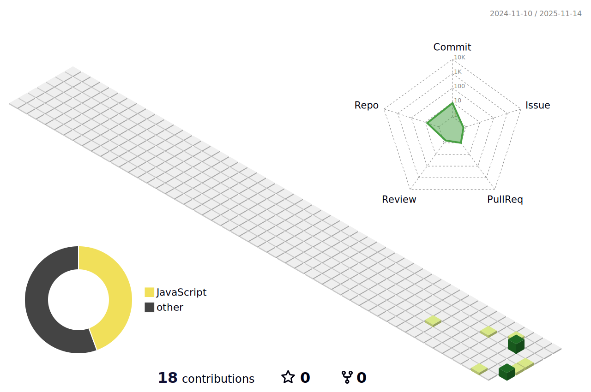

# Maxvy Quincy
AI Engineer in Progress | Learning ML, Python, and Applied AI

I am currently building my foundation in AI engineering — focusing on machine learning, Python development, model deployment, and agent-based systems. I enjoy learning by building real projects and experimenting with modern AI tools.

## What I'm Learning Right Now
- Python (loops, functions, OOP, modules)
- Machine Learning basics
- Neural networks fundamentals
- TensorFlow Lite model deployment
- Numpy & Pandas for data processing
- AI agent concepts and simple automation

## Projects I'm Working On
### MAXV1 – My Learning AI App
A beginner-friendly Flutter + TFLite app where I practice model inference and local AI features.

### Jarvis-TARS (Early Version)
My personal project to build a simple AI assistant using Python, speech recognition, and basic agent logic.

### Human Knowledge Map (Prototype)
Learning to build interactive systems using LLMs + graph data.

## My Goals
- Become strong in Python and ML fundamentals  
- Understand model training and model deployment  
- Build practical AI tools that actually work  
- Grow step-by-step into a real AI Engineer  

## 3D Contribution Graph
Generated automatically.

## Tools and Technologies I Use
- Python  
- Flutter (beginner level)  
- TensorFlow Lite  
- Pandas, Numpy  
- Git & GitHub  
- Gemini API & LLMs  

---

### Notes
This profile documents my progress as I learn AI engineering step by step.  
I update my work regularly as I grow my skillset.
